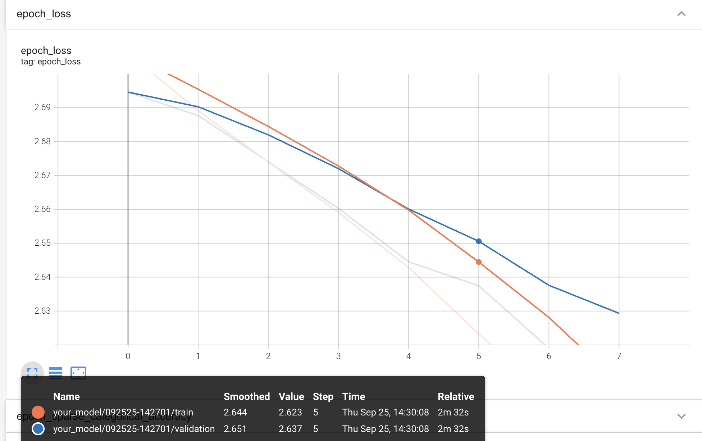
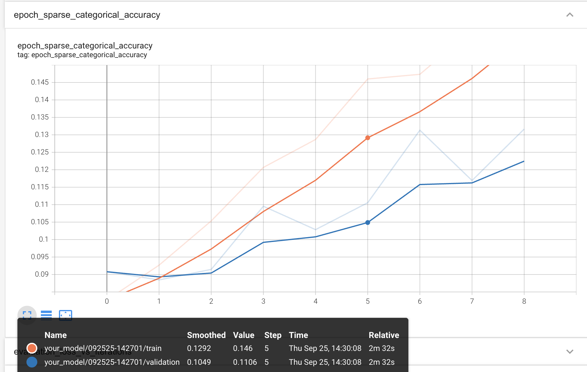

# CS 490/590 Results Log

This log help us to grade your work; it is not a report or write up.
- Be brief and precise.
- Be anonymous.

For each homework:
- Include the homework required items.
- Report if you attempted extra credit, let us know where it is in your code, and show its results.
- Any other information that you'd like us to have in grading, e.g., anything unusual or special, please let us know.

## Required homework items

### Task 1 - v0 Model 
In response this question (Task 1 - v0), here's my text answer:
Epochs: 50
Learning rate: 1e-4

First 6 epoch train accuracy:0.083, 0.093, 0.015, 0.121, 0.129, 0.146
First 6 epoch test accuracy:0.091, 0.088, 0.091, 0.110, 0.103, 0.111

Final accuracy(after epoch 50):
Train Accuracy (epoch 50): 0.5020
Test Accuracy (epoch 50): 0.2238

Notes:
- Model successfully trained above chance (6.67%).
- Run time: 25:42 mins
- Observation: The training loss decreased and training accuracy increased almost linearly, while the test loss/accuracy initially followed the same trend but plateaued after around 25 epochs.

In response this question (Task 1 - v0), here are required images:

###
In response to question x, here's my text answer.

## Extra credit?

I attemped these extra credits:
- One. In `thiscode.py`. The results were that xxxx. Here's an image:

- Two. In `thatcode.py`. The result was that yyyy. I even used some maths $xyz$.

## Anything else?

Giraffes---_how do they even?!_ 🦒